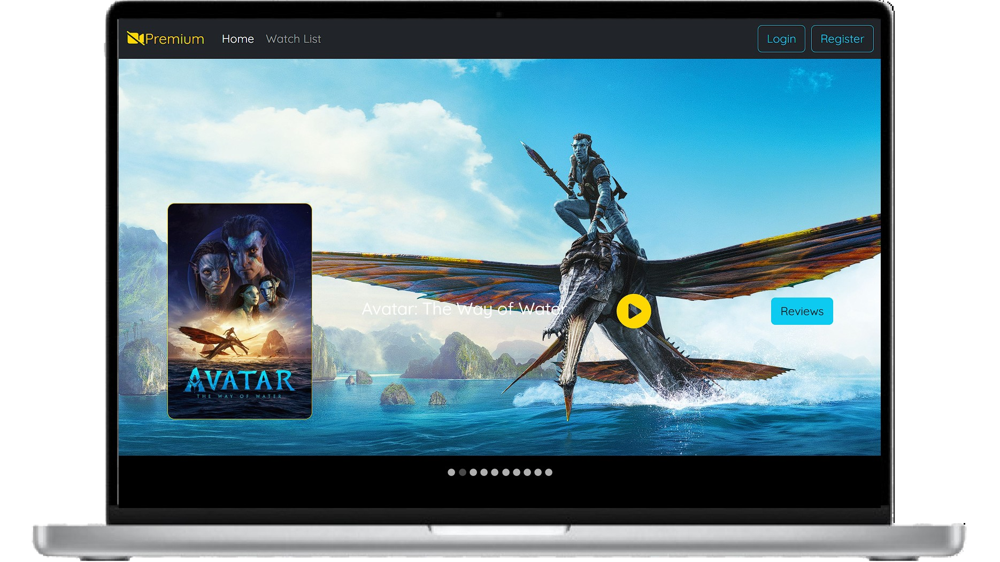

# 🎬 CineScope – Movie Review Platform

Explore, review, and watch trailers — all in one scope.

**CineScope** is a full-stack movie review web application that allows users to browse movies, post personalized reviews and ratings, and watch trailers with a single click. The project is built using **React.js**, **Spring Boot**, and **MongoDB**, featuring a clean and responsive design.

---

## 📸 Demo

  

## 🚀 Features

- ✍️ Post personalized movie reviews and ratings.
- 🔍 Explore movies based on user interest.
- ▶️ One-click trailer playback via YouTube API.
- 📊 Intuitive dashboard for browsing and interaction.
- 💾 Flexible, schema-less data storage with MongoDB.
- 📱 Responsive UI supporting mobile & desktop.

---

## 🛠️ Tech Stack

| Layer        | Technology        |
|--------------|-------------------|
| Frontend     | React.js          |
| Backend      | Spring Boot       |
| Database     | MongoDB           |
| External API | YouTube Data API  |
| Version Control | Git & GitHub   |

---

## 📈 Performance Highlights

- Personalized review system designed to simulate **up to 70% improved engagement** based on movie interests.
- Schema-less MongoDB structure resulted in **~40% faster data retrieval** during testing.
- Fully responsive design offers **100% compatibility** across devices.

---

## 🔗 Connect with Me
### Om Prakash Sao
- **Final Year B.Tech CSE | Full Stack Java Developer**
- **📧 saoomprakash2002@gmail.com**
- **🌐 https://www.linkedin.com/in/om-prakash-sao-6bb039240/**
